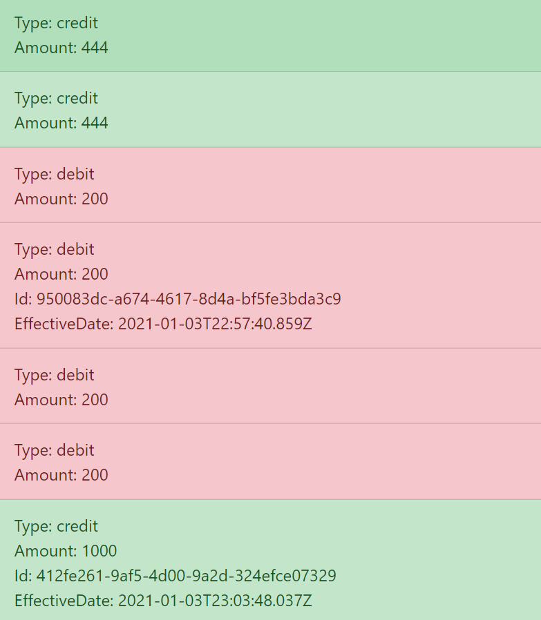

# Agile Engine Frontend

## Run the application

1. Navigate to `./agile-engine-frontend` directory with your terminal.
2. Execute the following commands: `yarn install` and then `yarn start` (make sure to have yarn installed globally)

## Details

This application consist in a simple React frontend where the user will be able to see its transaction history.

- Credit transactions are showed in Green.
- Debit transactions are showed in Red.
- If the user clicks on a transaction, the rest of the information will be displayed (Id and EffectiveDate).

Basic example:

